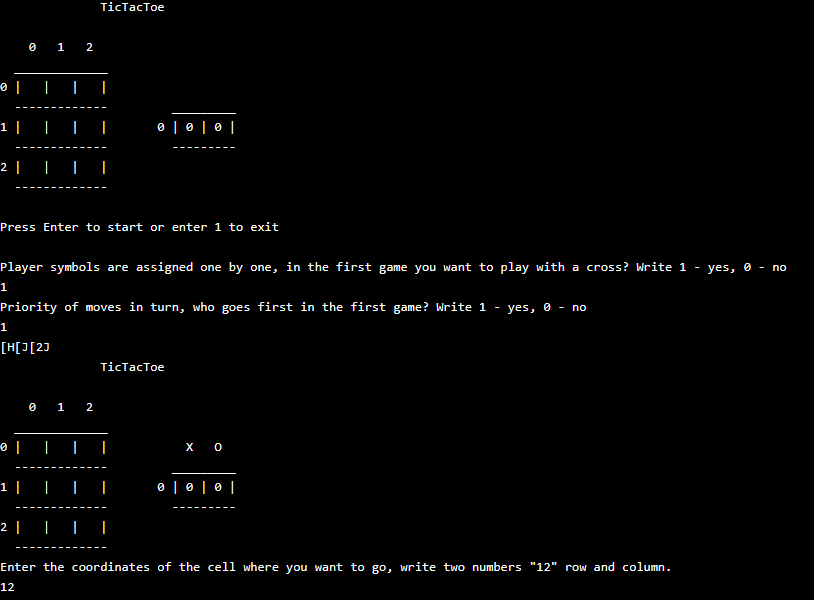
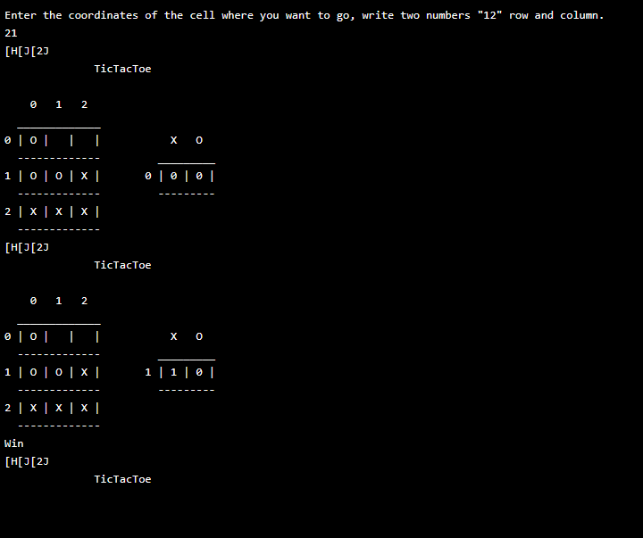

    </a>
     
     
    
    

### Данная программа реализует игру "Крестики-нолики" (Tic-Tac-Toe) для двух игроков в консольном режиме на языке C.

  
  

#### Основные компоненты программы

##### Определение ОС:
- Программа определяет, на какой операционной системе она запущена (Windows или Linux).

##### Глобальные переменные:
- `field[SIZE][SIZE]`: игровое поле размером 3x3.
- `navigation`, `symbol0`, `symbol`: переменные для управления навигацией и символами игроков.
- `game`, `wins`, `wins0`, `order`, `mov`, `step`: переменные для отслеживания состояния игры, количества побед и порядка ходов.

##### Функции:
- `main()`: основная функция, которая запускает игру и обрабатывает ввод пользователя.
- `Game()`: управляет порядком ходов игроков.
- `ManMove(char symbolmov)`: обрабатывает ход игрока, запрашивая координаты для размещения символа.
- `Start()`: инициализирует игру, запрашивая символы игроков и порядок ходов.
- `Empty()`: очищает игровое поле.
- `Conclusion()`: выводит текущее состояние игрового поля и статистику.
- `Win(char symbolmov)`: проверяет, есть ли победитель после каждого хода.
- `See(char symbolmov)`: обрабатывает ситуацию выигрыша, обновляет статистику и перезапускает игру.
- `See0()`: обрабатывает ничью.

#### Логика игры

- Игра начинается с вызова функции `Start()`, где игроки выбирают свои символы (X или O) и определяют, кто будет ходить первым.
- Игровое поле и статистика очищаются с помощью функции `Empty()`.
- Игроки поочередно делают ходы, вводя координаты ячейки, куда они хотят поставить свой символ. Ввод осуществляется в формате "xy", где x — номер строки, а y — номер столбца.
- После каждого хода программа проверяет, не выиграл ли кто-то из игроков, с помощью функции `Win()`. Если все ячейки заполнены и нет победителя, объявляется ничья.
- Игра продолжается до тех пор, пока один из игроков не решит выйти, нажав '1'.

#### Вывод информации

- Программа использует функции для очистки экрана и вывода текущего состояния игры, включая игровое поле и количество побед каждого игрока.

