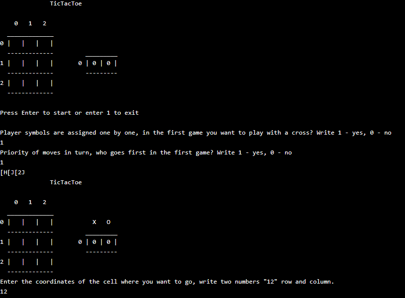

    </a>
     
     
    
    

### This program implements the game "Tic-Tac-Toe" for two players in console mode using the C programming language.

  
  

#### Main Components of the Program

##### Operating System Detection:
- The program determines which operating system it is running on (Windows or Linux).

##### Global Variables:
- `field[SIZE][SIZE]`: a 3x3 game board.
- `navigation`, `symbol0`, `symbol`: variables for managing navigation and player symbols.
- `game`, `wins`, `wins0`, `order`, `mov`, `step`: variables for tracking the game state, number of wins, and order of moves.

##### Functions:
- `main()`: the main function that starts the game and processes user input.
- `Game()`: manages the order of players' moves.
- `ManMove(char symbolmov)`: processes a player's move by requesting coordinates for placing the symbol.
- `Start()`: initializes the game by asking for player symbols and the order of moves.
- `Empty()`: clears the game board.
- `Conclusion()`: displays the current state of the game board and statistics.
- `Win(char symbolmov)`: checks if there is a winner after each move.
- `See(char symbolmov)`: handles the winning situation, updates statistics, and restarts the game.
- `See0()`: handles a draw.

#### Game Logic

- The game begins with the `Start()` function, where players choose their symbols (X or O) and determine who will go first.
- The game board and statistics are cleared using the `Empty()` function.
- Players take turns making moves by entering the coordinates of the cell where they want to place their symbol. Input is in the format "xy", where x is the row number and y is the column number.
- After each move, the program checks if either player has won using the `Win()` function. If all cells are filled and there is no winner, a draw is declared.
- The game continues until one of the players decides to exit by pressing '1'.

#### Information Output

- The program uses functions to clear the screen and display the current state of the game, including the game board and the number of wins for each player.

